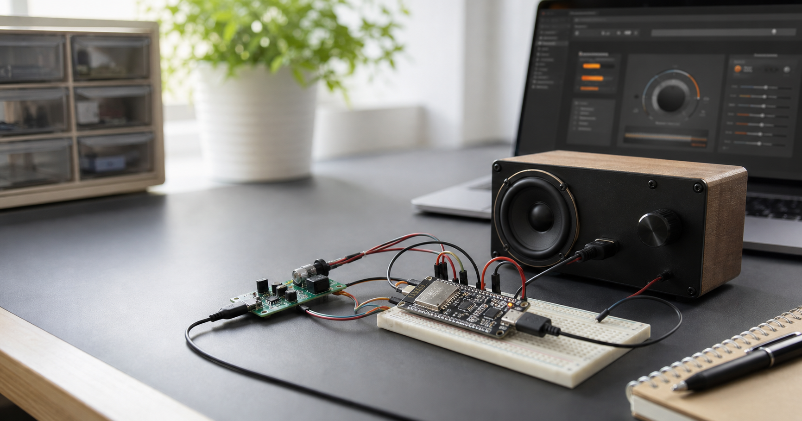
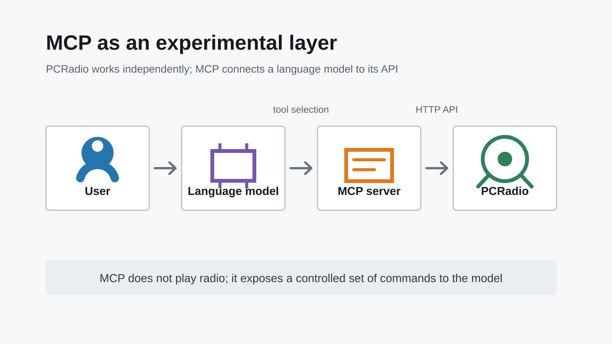

# Why I Added MCP to an ESP32 Internet Radio

PCRadio started as a standalone internet radio built around an ESP32-S3. It can
connect to a network, play radio stations, and be controlled through a web
interface. The device already had an HTTP API, so it did not need either a
language model or MCP for normal operation.

The original project is available on GitHub:
[pcradio.esp32](https://github.com/RootShell-coder/pcradio.esp32).

The MCP server was not added because the radio could not work without it. It
was a separate experiment. I wanted to understand how a language model works
with an external device, selects tools, and turns an ordinary sentence into an
exact API call.

## What MCP Means in This Project

Model Context Protocol allows an application to expose a set of tools to a
model, with clear names, descriptions, and argument schemas. Instead of getting
direct access to the device, the model sees a limited contract. It can, for
example, read the current state, find a station, change the volume, or configure
an alarm.

A command follows this path:

1. The user makes a request in natural language.
2. The model selects an appropriate MCP tool and supplies its arguments.
3. The MCP server validates the data and calls the PCRadio HTTP API.
4. The device performs the operation and returns the actual result.
5. The model explains that result to the user.

In this architecture, MCP is an adapter between the language model and an
existing API. It does not replace the firmware and does not take part in audio
playback.

## What Was Harder Than Expected

The demo looks simple: someone says "make it louder," the model calls a tool,
and the radio changes its volume. Real use quickly introduces ambiguity.

A station number from the main catalogue and a user-station number have
different meanings. Updating an alarm requires its real identifier and current
revision. A command must not be repeated blindly after a timeout because the
device may already have completed it. A question such as "which alarms are
configured?" must not produce an answer about the current station merely
because the model is more confident about that tool.

The main lesson was that a good function description is not enough. A contract
must state valid values, read and write order, identifier semantics, and the
expected result. The less the model has to guess, the more reliable the system
becomes.

## Why Some Capabilities Are Intentionally Unavailable

Not every device capability should be exposed to a model. The MCP server
intentionally provides no tools for OTA updates, the infrared service,
shutdown or standby, or deletion of user stations.

This is not a limitation of PCRadio. It is a boundary of the experiment. An
incorrect status response is inconvenient. An accidental firmware update or
device shutdown may require manual recovery. A capability existing on the
device does not mean it should automatically become available to a language
model.

## Do You Need a Language Model to Control a Radio?

For most commands, no. Requests such as "set volume to 30," "play station 10,"
or "show my alarms" can be parsed deterministically. A conventional router is
faster, cheaper, and more predictable than a language model.

A model is useful above that layer, when a request is open-ended, contains
several steps, or must be routed to the right specialized agent. In that
architecture, the local PCRadio agent remains strict and testable while the
model handles only routing and conversation.

That is why MCP was not an essential PCRadio product feature. It was a way to
study the practical side of working with language models:

- how accurately a model follows JSON Schema;
- when it invents missing data;
- how tool descriptions affect action selection;
- which operations can safely be delegated to a model;
- where conventional code remains the better solution.

## What the Experiment Produced

The experiment helped separate a convenient conversational interface from
reliable device control. MCP forced the existing HTTP API to be formalized,
parameter meanings to be clarified, and dangerous operations to be identified.
Contract tests became as important as code tests: the model must see exactly
the capabilities that the server actually provides.

The most useful result, however, was architectural. A language model does not
have to live inside every agent. When commands are unambiguous, a small
deterministic service is a better fit. A model can sit above those services and
route requests between them.

PCRadio will continue to work without MCP. The MCP server remains a separate
research layer and an example of how to connect a physical device to a language
model without granting it more authority than it needs.

Projects:

- [PCRadio for ESP32-S3](https://github.com/RootShell-coder/pcradio.esp32)
- [MCP server for PCRadio](https://github.com/RootShell-coder/pcradio.mcp)
